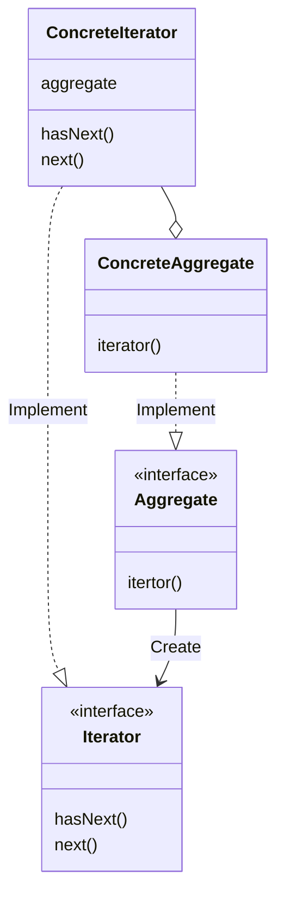

# design-pattern
## Iterator

```mermaid
classDiagram
class Aggregate
<<interface>> Aggregate
Aggregate: itertor()

class Iterator
<<interface>> Iterator
Iterator: hasNext()
Iterator: next()

class ConcreteAggregate {
    iterator()
}

class ConcreteIterator {
    aggregate
    hasNext()
    next()
}

ConcreteIterator ..|> Iterator: Implement
ConcreteAggregate ..|> Aggregate: Implement
Aggregate --> Iterator: Create
ConcreteIterator --o ConcreteAggregate
``` 

## Adapter
### Use Inheritance

### Use Delegation