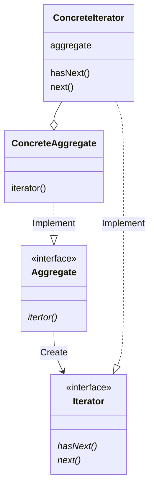

# Iterator Class Diatram

```mermaid
classDiagram
class Aggregate
<<interface>> Aggregate
Aggregate: itertor()*

class Iterator
<<interface>> Iterator
Iterator: hasNext()*
Iterator: next()*

class ConcreteAggregate {
    iterator()
}

class ConcreteIterator {
    aggregate
    hasNext()
    next()
}


Aggregate --> Iterator: Create
ConcreteAggregate ..|> Aggregate: Implement
ConcreteIterator ..|> Iterator: Implement
ConcreteIterator --o ConcreteAggregate
```