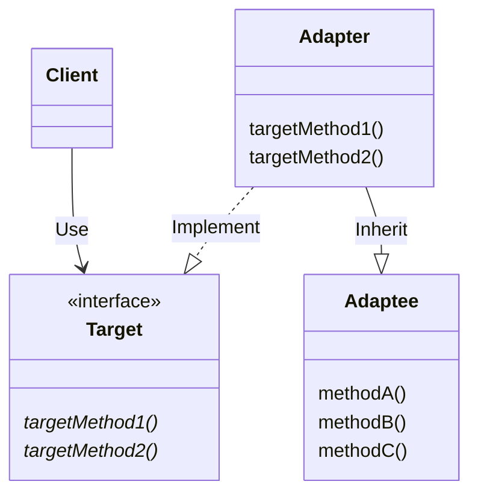
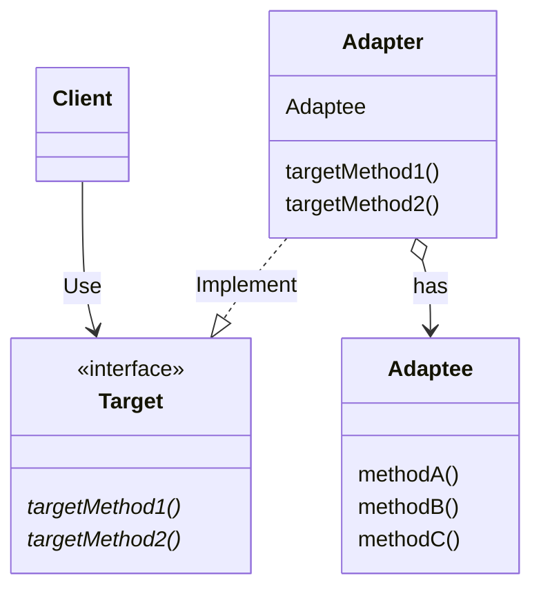

# Adapter Class Diagram
## Use Inheritance

```mermaid
classDiagram
class Client

class Target
<<interface>> Target
Target: targetMethod1()*
Target: targetMethod2()*

class Adapter
Adapter: targetMethod1()
Adapter: targetMethod2()

class Adaptee
Adaptee: methodA()
Adaptee: methodB()
Adaptee: methodC()

Client --> Target: Use
Adapter ..|> Target: Implement
Adapter --|> Adaptee: Inherit
```

## Use Delegation

```mermaid
classDiagram
class Client

class Target
<<interface>> Target
Target: targetMethod1()*
Target: targetMethod2()*

class Adapter
Adapter: Adaptee
Adapter: targetMethod1()
Adapter: targetMethod2()

class Adaptee
Adaptee: methodA()
Adaptee: methodB()
Adaptee: methodC()

Client --> Target: Use
Adapter ..|> Target: Implement
Adapter o--> Adaptee: has
```