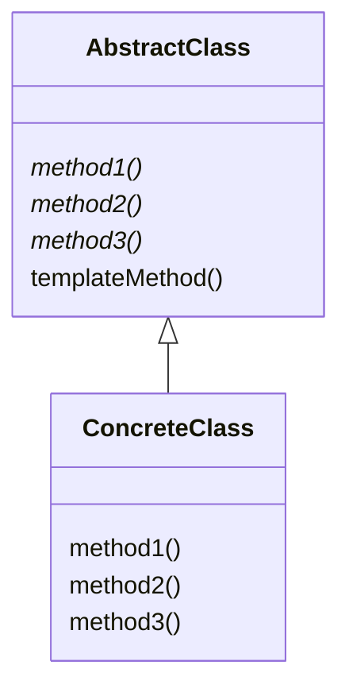

# Template Method Class Diagram

```mermaid
classDiagram
class AbstractClass
AbstractClass: method1()*
AbstractClass: method2()*
AbstractClass: method3()*
AbstractClass: templateMethod()

class ConcreteClass
ConcreteClass: method1()
ConcreteClass: method2()
ConcreteClass: method3()

AbstractClass <|-- ConcreteClass
```