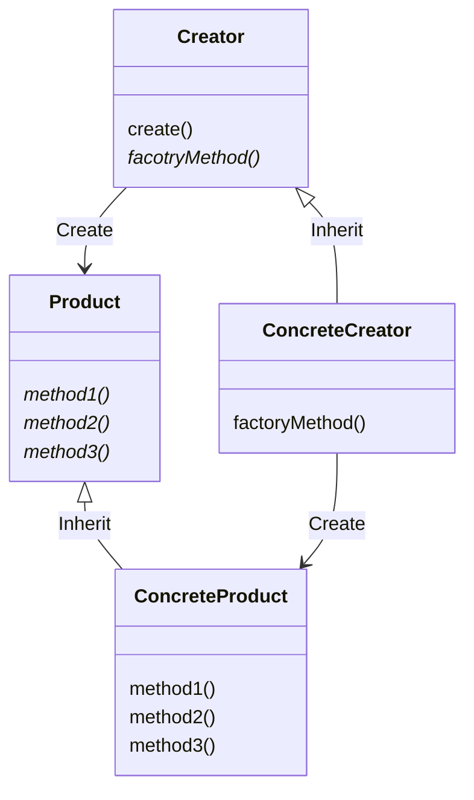

# Factory Method Class Diagram

```mermaid
classDiagram
class Creator
Creator: create()
Creator: facotryMethod()*

class Product
Product: method1()*
Product: method2()*
Product: method3()*

class ConcreteCreator
ConcreteCreator: factoryMethod()

class ConcreteProduct
ConcreteProduct: method1()
ConcreteProduct: method2()
ConcreteProduct: method3()

Creator --> Product: Create
Creator <|-- ConcreteCreator: Inherit
Product <|-- ConcreteProduct: Inherit
ConcreteCreator --> ConcreteProduct: Create
```