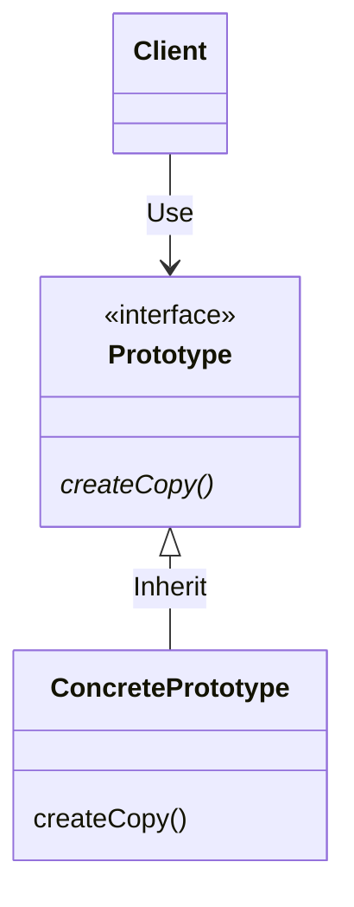

# Prototype Class Diagram

```mermaid
classDiagram
class Client

class Prototype
<<interface>> Prototype
Prototype: createCopy()*

class ConcretePrototype
ConcretePrototype: createCopy()

Client --> Prototype: Use
Prototype <|-- ConcretePrototype: Inherit
```