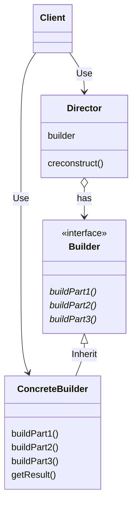
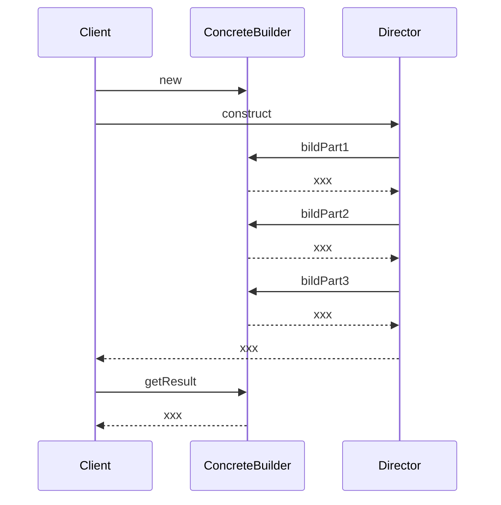

# Builder Class Diagram

```mermaid
classDiagram
class Client

class Director
Director: builder
Director: creconstruct()

class Builder
<<interface>> Builder
Builder: buildPart1()*
Builder: buildPart2()*
Builder: buildPart3()*

class ConcreteBuilder
ConcreteBuilder: buildPart1()
ConcreteBuilder: buildPart2()
ConcreteBuilder: buildPart3()
ConcreteBuilder: getResult()

Client --> Director: Use
Client --> ConcreteBuilder: Use
Director o--> Builder: has
Builder  <|-- ConcreteBuilder: Inherit
```

# Builder Class Sequence

```mermaid
sequenceDiagram
    Client->>ConcreteBuilder: new
    Client->>Director: construct
    Director->>ConcreteBuilder: bildPart1
    ConcreteBuilder-->>Director: xxx
    Director->>ConcreteBuilder: bildPart2
    ConcreteBuilder-->>Director: xxx
    Director->>ConcreteBuilder: bildPart3
    ConcreteBuilder-->>Director: xxx
    Director-->>Client: xxx
    Client->>ConcreteBuilder: getResult
    ConcreteBuilder-->>Client: xxx
```