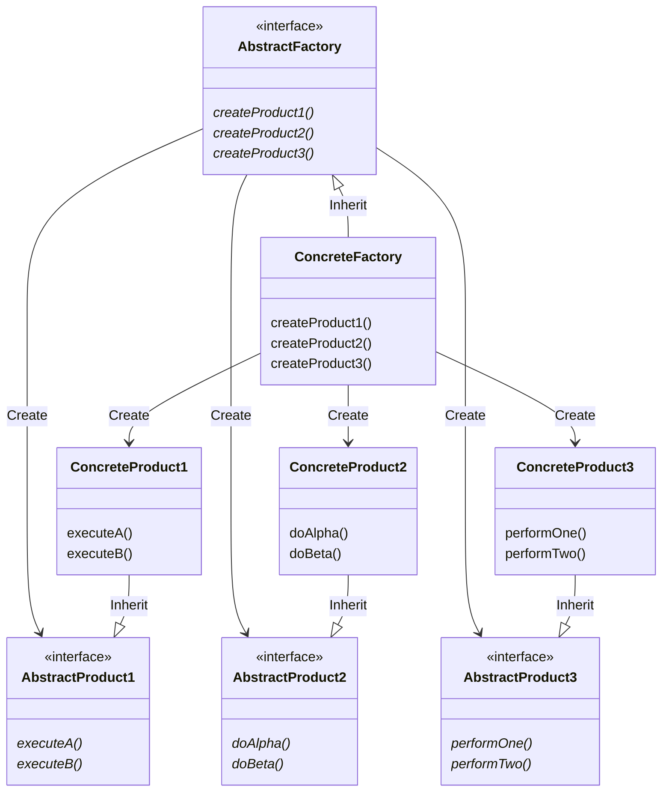

# Abstract Class Diagram

```mermaid
classDiagram
class AbstractFactory
<<interface>> AbstractFactory
AbstractFactory: createProduct1()*
AbstractFactory: createProduct2()*
AbstractFactory: createProduct3()*

class AbstractProduct1
<<interface>> AbstractProduct1
AbstractProduct1: executeA()*
AbstractProduct1: executeB()*

class AbstractProduct2
<<interface>> AbstractProduct2
AbstractProduct2: doAlpha()*
AbstractProduct2: doBeta()*

class AbstractProduct3
<<interface>> AbstractProduct3
AbstractProduct3: performOne()*
AbstractProduct3: performTwo()*

class ConcreteFactory
ConcreteFactory: createProduct1()
ConcreteFactory: createProduct2()
ConcreteFactory: createProduct3()

class ConcreteProduct1
ConcreteProduct1: executeA()
ConcreteProduct1: executeB()

class ConcreteProduct2
ConcreteProduct2: doAlpha()
ConcreteProduct2: doBeta()

class ConcreteProduct3
ConcreteProduct3: performOne()
ConcreteProduct3: performTwo()

AbstractFactory --> AbstractProduct1: Create
AbstractFactory --> AbstractProduct2: Create
AbstractFactory --> AbstractProduct3: Create
AbstractFactory <|-- ConcreteFactory: Inherit
ConcreteProduct1 --|> AbstractProduct1: Inherit
ConcreteProduct2 --|> AbstractProduct2: Inherit
ConcreteProduct3 --|> AbstractProduct3: Inherit
ConcreteFactory --> ConcreteProduct1: Create
ConcreteFactory --> ConcreteProduct2: Create
ConcreteFactory --> ConcreteProduct3: Create
```