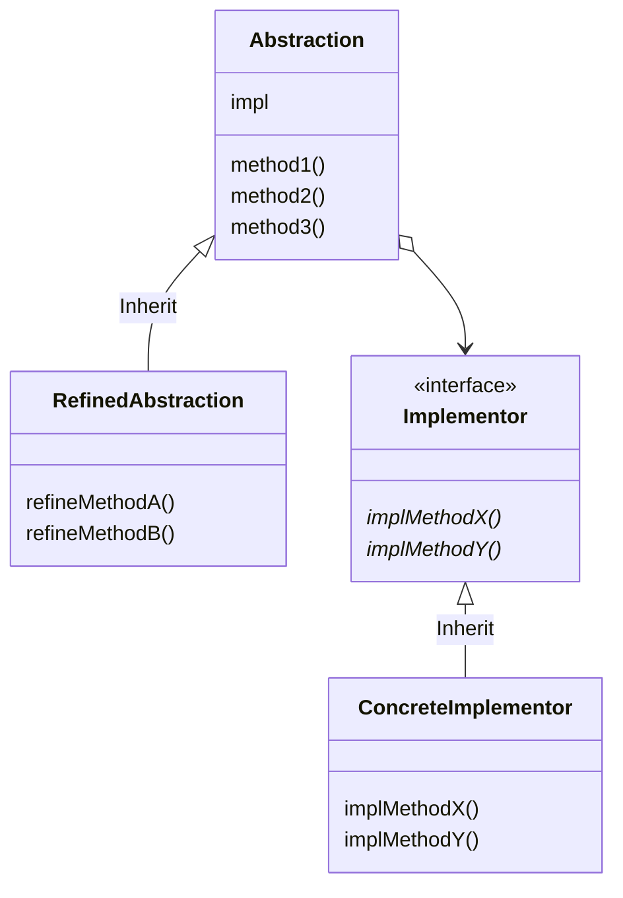

# Abstract Class Diagram

```mermaid
classDiagram
class Abstraction
Abstraction: impl
Abstraction: method1()
Abstraction: method2()
Abstraction: method3()

class RefinedAbstraction
RefinedAbstraction: refineMethodA()
RefinedAbstraction: refineMethodB()

class Implementor
<<interface>> Implementor
Implementor: implMethodX()*
Implementor: implMethodY()*

class ConcreteImplementor
ConcreteImplementor: implMethodX()
ConcreteImplementor: implMethodY()

Abstraction o--> Implementor
Abstraction <|-- RefinedAbstraction: Inherit
Implementor <|-- ConcreteImplementor: Inherit
```