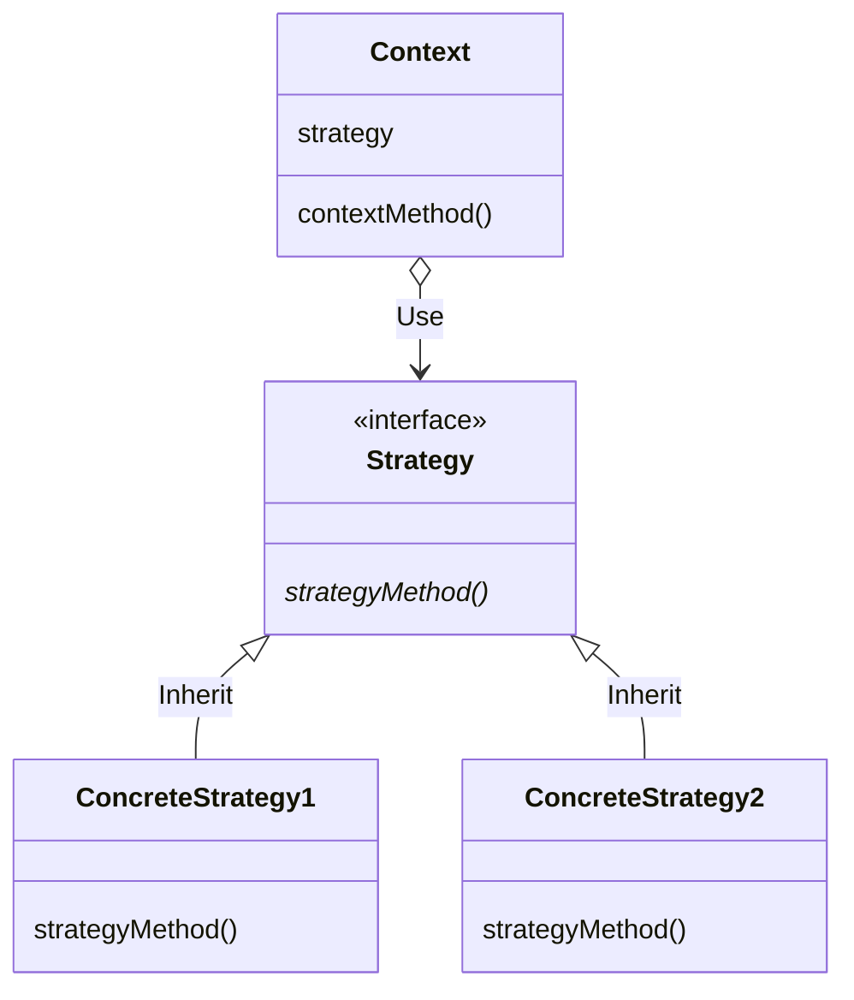

# Strategy Class Diagram

```mermaid
classDiagram
class Context
Context: strategy
Context: contextMethod()

class Strategy
<<interface>> Strategy
Strategy: strategyMethod()*

class ConcreteStrategy1
ConcreteStrategy1: strategyMethod()

class ConcreteStrategy2
ConcreteStrategy2: strategyMethod()

Context o--> Strategy: Use
Strategy <|-- ConcreteStrategy1: Inherit
Strategy <|-- ConcreteStrategy2: Inherit
```