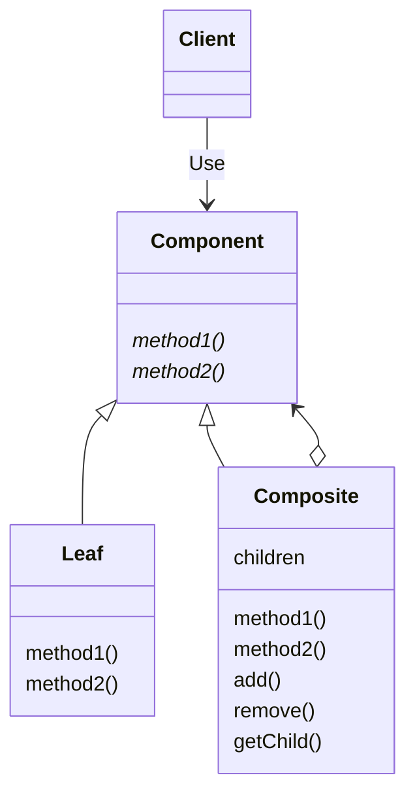

# Composite Class Diagram

```mermaid
classDiagram
class Client

class Component
Component: method1()*
Component: method2()*

class Leaf
Leaf: method1()
Leaf: method2()

class Composite
Composite: children
Composite: method1()
Composite: method2()
Composite: add()
Composite: remove()
Composite: getChild()

Client --> Component :Use
Component <|-- Leaf
Component <|-- Composite
Component <--o Composite
```