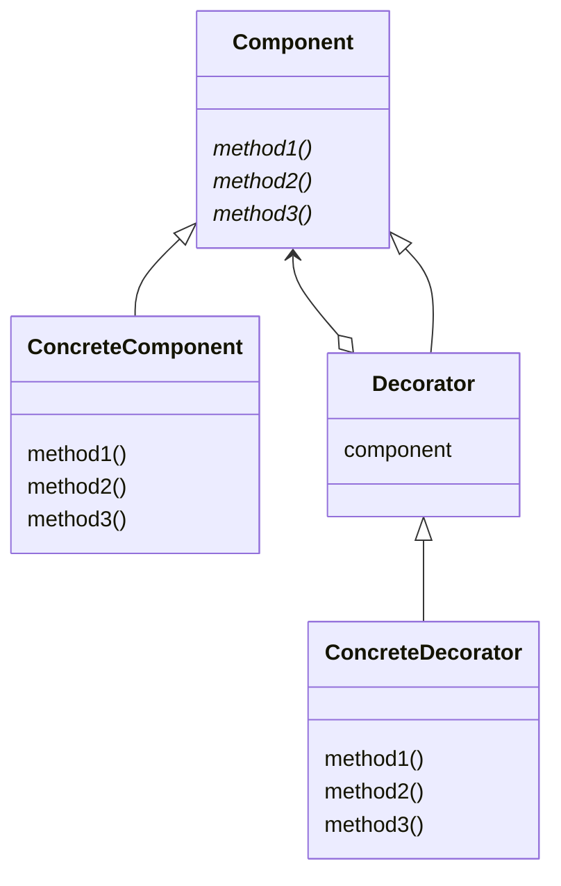

# Decorator Class Diagram

```mermaid
classDiagram
class Component
Component: method1()*
Component: method2()*
Component: method3()*

class ConcreteComponent
ConcreteComponent: method1()
ConcreteComponent: method2()
ConcreteComponent: method3()

class Decorator
Decorator: component

class ConcreteDecorator
ConcreteDecorator: method1()
ConcreteDecorator: method2()
ConcreteDecorator: method3()

Component <--o Decorator
Component <|-- Decorator
Component <|-- ConcreteComponent
Decorator <|-- ConcreteDecorator
```