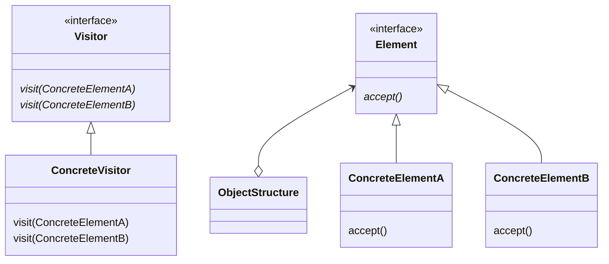

# Visitor Class Diagram

```mermaid
classDiagram
class Visitor
<<interface>> Visitor
Visitor: visit(ConcreteElementA)*
Visitor: visit(ConcreteElementB)*

class ConcreteVisitor
ConcreteVisitor: visit(ConcreteElementA)
ConcreteVisitor: visit(ConcreteElementB)

class Element
<<interface>> Element
Element: accept()*

class ConcreteElementA
ConcreteElementA: accept()

class ConcreteElementB
ConcreteElementB: accept()

class ObjectStructure

Visitor <|-- ConcreteVisitor
Element <--o ObjectStructure
Element <|-- ConcreteElementA
Element <|-- ConcreteElementB
```