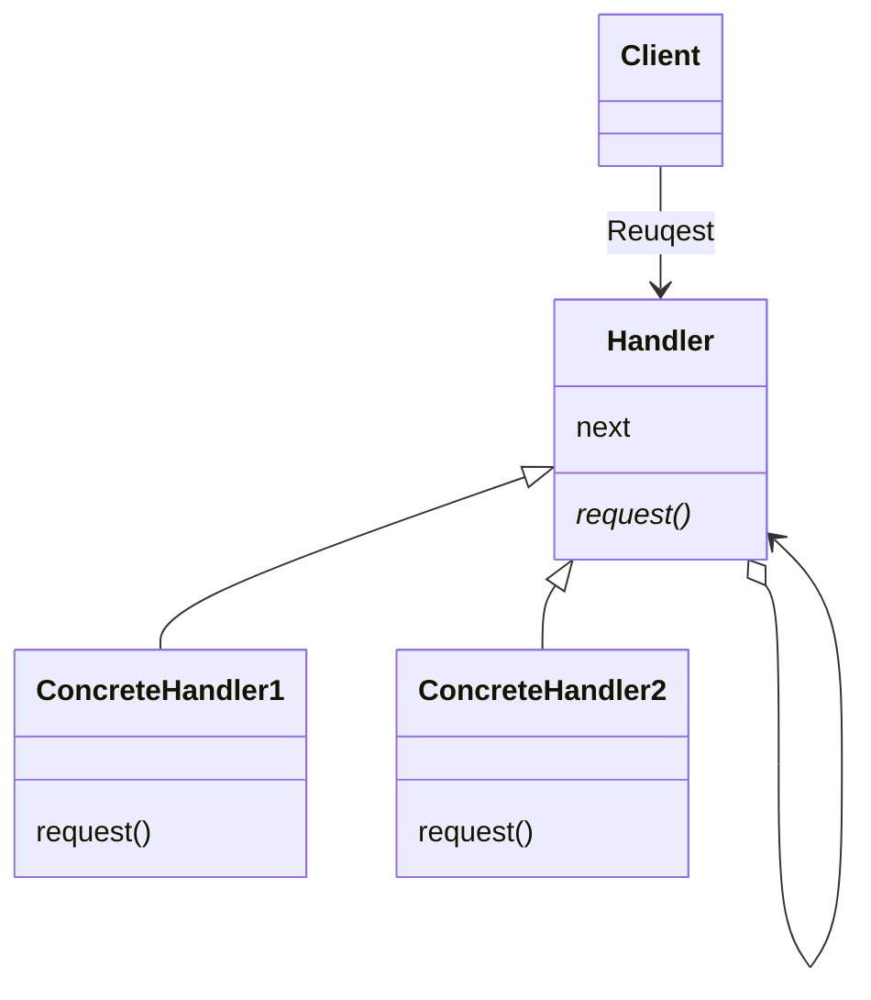

# Chain of Responsibility Class Diagram

```mermaid
classDiagram
class Client

class Handler
Handler: next
Handler: request()*

class ConcreteHandler1
ConcreteHandler1: request()

class ConcreteHandler2
ConcreteHandler2: request()

Client --> Handler: Reuqest
Handler o--> Handler
Handler <|-- ConcreteHandler1
Handler <|-- ConcreteHandler2
```