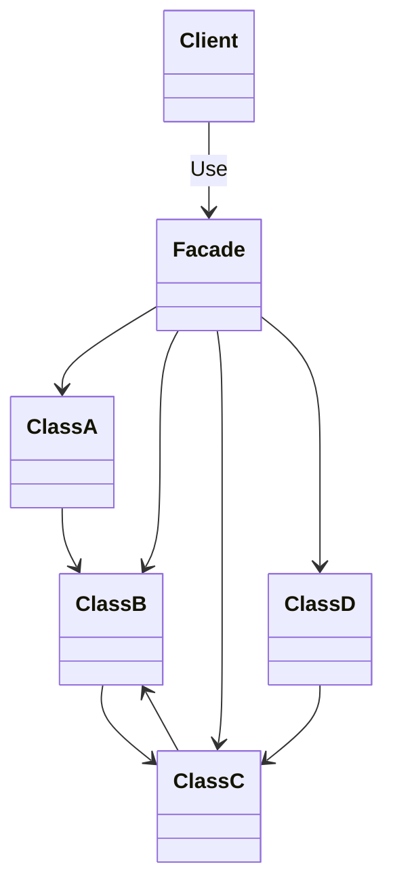

# Facade Class Diagram

```mermaid
classDiagram
class Client

class Facade

class ClassA

class ClassB

class ClassC

class ClassD

Client --> Facade: Use
Facade --> ClassA
Facade --> ClassB
Facade --> ClassC
Facade --> ClassD
ClassA --> ClassB
ClassB --> ClassC
ClassC --> ClassB
ClassD --> ClassC
```