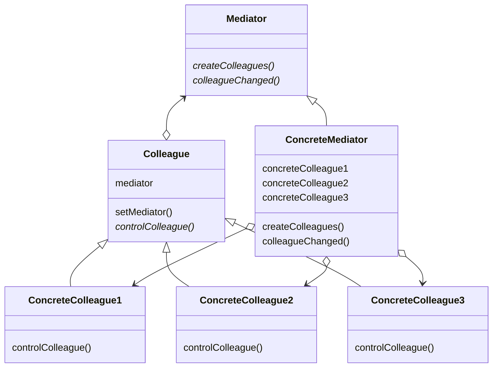

# Mediator Class Diagram

```mermaid
classDiagram
class Mediator
Mediator: createColleagues()*
Mediator: colleagueChanged()*

class ConcreteMediator
ConcreteMediator: concreteColleague1
ConcreteMediator: concreteColleague2
ConcreteMediator: concreteColleague3
ConcreteMediator: createColleagues()
ConcreteMediator: colleagueChanged()

class Colleague
Colleague: mediator
Colleague: setMediator()
Colleague: controlColleague()*

class ConcreteColleague1
ConcreteColleague1: controlColleague()

class ConcreteColleague2
ConcreteColleague2: controlColleague()

class ConcreteColleague3
ConcreteColleague3: controlColleague()

Mediator <--o Colleague
Mediator <|-- ConcreteMediator
Colleague <|-- ConcreteColleague1
Colleague <|-- ConcreteColleague2
Colleague <|-- ConcreteColleague3
ConcreteMediator o--> ConcreteColleague1
ConcreteMediator o--> ConcreteColleague2
ConcreteMediator o--> ConcreteColleague3
```